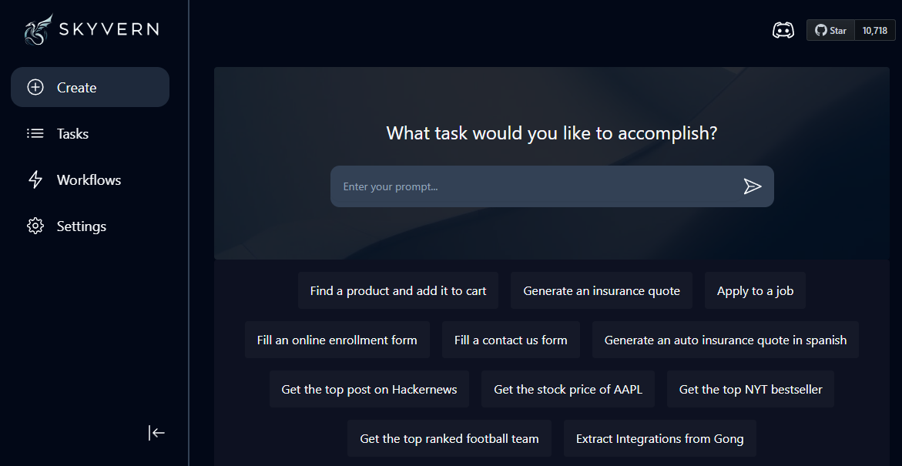

# Skyvern AI CI/CD pipeline

Deploy Skyvern AI server with CI/CD on Elestio

 
 

# Once deployed ...

You can open Skyvern AI here:

    URL: https://[CI_CD_DOMAIN]
    login: "root"
    password: "[ADMIN_PASSWORD]"

You can open pgAdmin here:

    URL: https://[CI_CD_DOMAIN]:59471
    login: "[ADMIN_EMAIL]"
    password: "[ADMIN_PASSWORD]"
